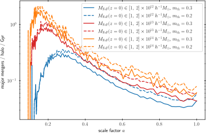

Examples
========

Average Mass-Growth
-------------------

.. literalinclude:: example_mass_growth.py
   :language: python

.. image:: massgrowth_example.svg

Major Merger Rate 
-----------------

.. literalinclude:: example_merger_rate.py
   :language: python

Nucleation Rate 
---------------