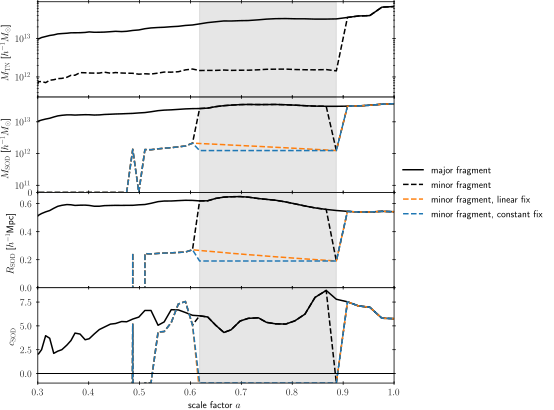

Dealing with Fragments
======================

.. currentmodule:: haccytrees.mergertrees

During a simulation run, halos sometimes come within the FoF linking length
(i.e. merge), but later disassociate again. Since we generally assume that halos
don't split, these "wrongly" merged halos are disentangled in a post-processing
step, and labeled as fragments during the time they were part of a "combined"
FoF group.

However, some of the halo properties are only calculated once for each FoF group
on-the-fly during the simulation, e.g. the SOD properties. Therefore, the SOD
property is only known for the "major" fragment in a split FoF group, and not 
for the "minor" fragments. It is important to keep this in mind whenever dealing 
with properties that are not aware of the fragment status.

HaccyTrees includes some functionality that attempts to correct those properties
for minor fragments, discussed further below.

Identifying Fragments
---------------------

The fragment status is encoded in the ``fof_halo_tag``, which is composed of the
original FoF tag that was assigned on-the-fly, as well as the fragment index.
Index 0 corresponds to the "main" or "major" fragment, for which we can assume
that the SOD properties are correct. Minor fragments will have a fragment index
larger than 0.

The ``fof_halo_tag`` for fragments is constructed with the following scheme:

.. math::

   -1 \cdot \Big[ \text{fragment index (16 bit)} \; \Big| \; \text{parent fof tag (48 bit} \Big]

The two components can be extracted with the function
:func:`split_fragment_tag`, which can be applied to all negative 
``fof_halo_tag`` to find the original FoF tag as well as the fragment index. 

.. note::

   Since the merger-tree forests for large simulations are split among multiple
   files, determined by the positions of the root halos at z=0, **it is not
   guaranteed that the main fragment is in the same file as the minor
   fragments**, in case belong to distinct trees (i.e. they don't share the same
   root halo / they never merge). The affected fragments will all be located at
   the boundary of the file extent, i.e. their main fragment can be found in the
   file that covers the neighboring subvolume.

Properties of Minor Fragments
-----------------------------

As previously noted, some quantities are only computed once per FoF group and
normally only apply for the main fragment in a split FoF halo (fragment index
0). However, minor fragments will be assigned the same value, which generally
is not correct.

One can either mask out these affected branches by identifying the minor
fragments (see previous section) or attempt to "correct" the properties by
looking at the properties before and after the halo became a minor fragment and
doing some sort of interplolation inbetween. The function
:func:`fix_fragment_properties` provides two kind of corrections that can be
applied to all minor fragments in a forest, either by linearly interpolating
between the starting and ending value, or by setting the properties to a 
constant value.

As an example, here is how one would "correct" the SOD mass, radius, and
concentration:

.. code-block:: python

   %%time
   forest, progenitor_array = haccytrees.mergertrees.read_forest(
       "/data/a/cpac/mbuehlmann/LastJourney/forest/m000p.forest.000.hdf5", 
       'LastJourney', nchunks=20, chunknum=0)

.. code-block:: none

   CPU times: user 558 ms, sys: 1.04 s, total: 1.6 s
   Wall time: 1.6 s

.. code-block:: python

   %%time
   haccytrees.mergertrees.fix_fragment_properties(
       forest, 
       ['sod_halo_mass', 'sod_halo_radius', 'sod_halo_cdelta'],
       inplace=False, suffix='_fragfix_const', interpolation='constant_reverse',
       mask_negative=False
   )
   haccytrees.mergertrees.fix_fragment_properties(
       forest, 
       ['sod_halo_mass', 'sod_halo_radius', 'sod_halo_cdelta'],
       inplace=False, 
       suffix='_fragfix_lin', 
       interpolation='linear',
       mask_negative=True
   )

.. code-block:: none

   CPU times: user 817 ms, sys: 80.3 ms, total: 898 ms
   Wall time: 896 ms
  
After these function calls, additional arrays are added to the forest, suffixed
with ``_fragfix_lin`` and ``_fragfix_const``. For the following figure, we pick
a halo in the Last Journey simulation that is fragmented at snapshot number 95
and plot the evolution of the ``tree_node_mass``, ``sod_halo_mass``,
``sod_halo_radius``, and ``sod_halo_cdelta`` for the major fragment and a minor
fragment:

   
   Evolution of the tree-node mass, SOD mass, SOD radius, and SOD concentration 
   (from top to bottom) of the major and a minor fragment branch. The time where 
   the two halos share the same FoF group is highlighted in grey. Blue and
   orange lines show the constant and linear corrections for the minor fragment.

Node that in the original catalog, the SOD properties of the minor fragment have
the same value as the ones of the major fragment, by construction. After
applying the corrections, the SOD mass and SOD radius are either linearly
interpolated or set to a constant value (the quantities that the halo has once
it becomes the major fragment or an independant halo). Since ``cdelta == -1`` 
when the minor fragment becomes independant, no interpolation is done (since we
set ``mask_negative=True``), but instead ``cdelta`` is set to -1 throughout the
minor-fragment phase.

Not that the minor and major fragments eventually merge.

References
----------

.. autofunction:: split_fragment_tag

.. autofunction:: fix_fragment_properties