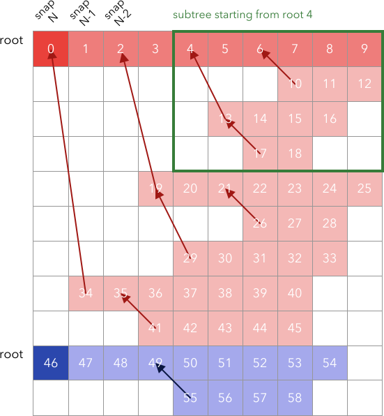

.. _sec-forest-layout:

Merger Forest Layout
====================

The forest data is stored in HDF5 files, in one-dimensional arrays under the
group ``forest``. If the forest is split into multiple files, each file is
`closed`, i.e. individual trees are never split.

Instead of using array pointers, the tree-hierarchy is embedded in the ordering
of the data. Array pointers to descendant and progenitor halos can be generated
during the read-in of the forest data, see
:meth:`haccytrees.mergertrees.read_forest`. The tree data is ordered depth-first
and by ``tree-node-mass``, i.e. a main-progenitor branch is contiguous in the
array, starting from the root halo. This layout also has the advantage that a
sub-tree (e.g. starting from a progenitor at redshift 1) is contiguous in the
data arrays. To facilitate extracting a sub-tree, there is a forest array
``branch_size``, which stores the size of each halo's subtree.

The following figure illustrates a small forest with two trees, spanning 10 
snapshots:

   Memory layout of a tree. Numbers show the array position, arrows incidate 
   mergers. Each row is the main progenitor branch of the first halo in that 
   row, columns are snapshots, starting with the latest snapshot (z=0) on the 
   left.

The trees start with the root halo at the latest snapshot, followed by its main
progenitor branch. Then, the array continues with the earliest merger into this
branch and its progenitors, and so on. In the following table, we list the
branch size of each of the halos. Note that ``branch_size`` refers to the size
of the subtree starting at this halo.

===== =======  ===========
index snapnum  branch_size
===== =======  ===========
0     9        46
1     8        33
2     7        32
3     6        16
4     5        15
5     4        8
6     3        7
7     2        3
8     1        2
9     0        1
10    2        3
11    1        2
12    0        1
13    4        6
14    3        3
15    2        2
16    1        1
17    3        2
18    2        1
...   ...      ...
46    9        13
47    8        12
...   ...      ...
===== =======  ===========

The ``snapnum`` column and the ordering of our data are sufficient to
reconstruct the tree structure. During read-in of the forests, the code
constructs additional arrays that help navigating the tree, without having to be
aware of the data layout:

-  ``desc_index``: the array index to the descendant halo
-  ``progenitor_array``, ``progenitor_offset``, ``progenitor_count``: These arrays 
   help finding the indices of all progenitors associated with a halo, ordered 
   by ``tree_node_mass``:

   .. code-block:: python

      start = forest['progenitor_offset'][i]
      end = start + forest['progenitor_count'][i]
      progenitor_indices = progenitor_array[start:end]

Available Columns
-----------------

Here is a list of all data-columns in the HDF5 files as well as the arrays that
are automatically constructed by haccytrees during the reading of those files:

.. table:: Columns stored in the HDF5 file
   :widths: 30 60 10
   :class: full-width
   
   +-----------------------+-------------------------------------------------------+----------------------------+
   |          Key          |                      Description                      |           Units            |
   +=======================+=======================================================+============================+
   | tree_node_index       | the unique ID given to the halo in the treenode files |                            |
   +-----------------------+-------------------------------------------------------+----------------------------+
   | desc_node_index       | the tree_node_index of the descendant halo, -1 if no  |                            |
   |                       | descendant                                            |                            |
   +-----------------------+-------------------------------------------------------+----------------------------+
   | fof_halo_tag          | the FoF halo ID given by the in-situ halofinder.      |                            |
   |                       | For a fragmented halo                                 |                            |
   |                       | (:ref:`reading/fragments:Dealing with Fragments`),    |                            |
   |                       | the tag is negative                                   |                            |
   +-----------------------+-------------------------------------------------------+----------------------------+
   | snapnum               | the enumerated output, starting at 0 for the first    |                            |
   |                       | snapshot                                              |                            |
   +-----------------------+-------------------------------------------------------+----------------------------+
   | tree_node_mass        | the FoF mass of the halo, corrected for fragments     | :math:`h^{-1}M_\odot`      |
   +-----------------------+-------------------------------------------------------+----------------------------+
   | fof_halo_mass         | the FoF mass of the halo                              | :math:`h^{-1}M_\odot`      |
   +-----------------------+-------------------------------------------------------+----------------------------+
   | fof_halo_count        | the number of particles in the FoF group              |                            |
   +-----------------------+-------------------------------------------------------+----------------------------+
   | sod_halo_mass         | the SOD mass (usually at 200c overdensity)            | :math:`h^{-1}M_\odot`      |
   +-----------------------+-------------------------------------------------------+----------------------------+
   | sod_halo_radius       | the SOD radius (usually at 200c overdensity)          | :math:`h^{-1}\mathrm{Mpc}` |
   +-----------------------+-------------------------------------------------------+----------------------------+
   | sod_halo_cdelta       | the SOD concentration parameter                       |                            |
   +-----------------------+-------------------------------------------------------+----------------------------+
   | sod_halo_cdelta_error | the error estimate of sod_halo_cdelta                 |                            |
   +-----------------------+-------------------------------------------------------+----------------------------+
   | sod_halo_cdelta_accum | the SOD concentration parameter calculated using the  |                            |
   |                       | accumulated mass algorithm                            |                            |
   +-----------------------+-------------------------------------------------------+----------------------------+
   | sod_halo_cdelta_peak  | the SOD concentration parameter calculated using the  |                            |
   |                       | dM/dr peak algorithm                                  |                            |
   +-----------------------+-------------------------------------------------------+----------------------------+
   | xoff_fof              | the offset of the FoF center of mass and potential    |                            |
   |                       | minimum, normalized by ``sod_halo_radius``            |                            |
   +-----------------------+-------------------------------------------------------+----------------------------+
   | xoff_sod              | the offset of the SOD center of mass and potential    |                            |
   |                       | minimum, normalized by ``sod_halo_radius``            |                            |
   +-----------------------+-------------------------------------------------------+----------------------------+
   | xoff_com              | the offset of the FoF center of mass and the SOD      |                            |
   |                       | center of mass, normalized by ``sod_halo_radius``     |                            |
   +-----------------------+-------------------------------------------------------+----------------------------+
   | branch_size           | the size (in the forest array) of the subtree         |                            |
   |                       | starting at this halo                                 |                            |
   +-----------------------+-------------------------------------------------------+----------------------------+
   

.. table:: Additional columns generated during reading
   :widths: 30 70
   :class: full-width
   
   +-------------------+----------------------------------------------------+
   |        Key        |                    Description                     |
   +===================+====================================================+
   | scale_factor      | scale factor                                       |
   +-------------------+----------------------------------------------------+
   | halo_idx          | the array position of the halo, created during the |
   |                   | reading of the forest file                         |
   +-------------------+----------------------------------------------------+
   | descendant_idx    | the array position of the descendant halo, created |
   |                   | during the reading of the forest file              |
   +-------------------+----------------------------------------------------+
   | progenitor_count  | the number of progenitor this halo has             |
   +-------------------+----------------------------------------------------+
   | progenitor_offset | the location in the ``progenitor_array`` where the |
   |                   | array indices to the progenitors are stored        |
   +-------------------+----------------------------------------------------+

The reader also generates a ``progenitor_array`` storing the indices of the
progenitor halos for each halo. This array can be used in conjunction with
``progenitor_count`` and ``progenitor_offset``. See :ref:`sec-reading-a-forest`
for more details.