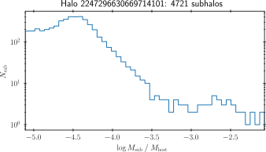

Subhalo Mass Model
==================

.. currentmodule:: haccytrees.mergertrees

The HACC merger trees (unlike the core-catalogs) do not contain any substructure
information. However, it is still possible to model the mass-loss of the merging
halos, using the subhalo mass model discussed in [Sultan2020]_. This model only
depends on the mass of the subhalo and the host halo at infall:

.. math::

   m(t + \Delta t) =
   \begin{cases}
        m(t) \; \exp -\frac{\Delta t}{\tau} & \zeta = 0 \\
        m(t) \left[
            1 + \zeta \left(
            \frac{m(t)}{M_\mathrm{host}(t)}
            \right)^\zeta \frac{\Delta t}{\tau}
        \right]^{-1 / \zeta} & \mathrm{else},
   \end{cases}

where :math:`\tau` is the characteristic timescale of the subhalo mass loss (see
paper) and :math:`\zeta` and :math:`A` are free model parameters. In
[Sultan2020]_, :math:`\zeta=0.1` and :math:`A=1.1` have been found providing a
good fit over a large range of halo masses and redshifts.

Creating subhalo data
---------------------

The function :func:`create_submass_data` applies this mass-model to a merger
forest and allows querying the substructure masses of any halo in the forest. It
can be used as shown in this Last Journey example, where we decide to ignore
subhalos below a mass of :math:`1 \times 10^{10} h^{-1}M_\odot` and also
generate substructure statistics for each host halo:

.. code-block:: python

   subhalo_data = haccytrees.mergertrees.create_submass_data(
       forest,
       'LastJourney',
       mass_threshold=1e10,
       compute_fsub_stats=True)

Setting ``compute_fsub_stats=True`` will add two columns to ``forest``,
``fsubmax`` and ``fsubtot``. The are defined as

.. math::

   f_\mathrm{sub, max} &= \frac{\max_i M_\mathrm{sub}}{M_\mathrm{host}}\\
   f_\mathrm{sub, tot} &= \frac{\sum_i M_\mathrm{sub}}{M_\mathrm{host}},

where :math:`i` runs over all subhalos of the host above the mass threshold.

Accessing subhalos
------------------

Individual subhalo masses can be accessed using the ``subdata_offset`` and
``subdata_size`` arrays in conjunction with the ``subhalo_data`` arrays. Let's
find the subhalos of the most massive halo in our forest and plot their mass
distribution relative to the host halo:

.. code-block:: python

   target_idx = np.argmax(forest['tree_node_mass'])
   start_idx = forest['subdata_offset'][target_idx]
   end_idx = start_idx + forest['subdata_size'][target_idx]
   subhalo_masses = subhalo_data['mass'][start_idx:end_idx]

   fig, ax = plt.subplots(figsize=(5, 3))
   target_mass = forest['tree_node_mass'][target_idx]
   target_tnidx = forest['tree_node_index'][target_idx]
   h, e, _ = ax.hist(np.log10(subhalo_masses/target_mass), 50, histtype='step');
   ax.set(yscale='log', xlim=e[[0,-1]],
          xlabel=r'$\log M_\mathrm{sub} \; / \; M_\mathrm{host}$',
          ylabel=r'$N_\mathrm{sub}$')
   ax.set_title(f'Halo {target_tnidx}: {len(subhalo_masses)} subhalos')
   fig.tight_layout()

   Mass distribution of the subhalos belonging to the most massive halo in our
   sample (``tree_node_index=2247296630669714101``, ``M = 1.28e15 # h-1 Msun``).

Following subhalo evolutions
----------------------------

It is also possible to follow the (modeled) mass evolution of a merging halo as
it merges and becomes a subhalo. The following example shows how one can do
this for a merger into the halo discussed above.

References
----------

.. autofunction:: create_submass_data

.. [Sultan2020] Sultan et al. (2020)
   arXiv: `2012.09262 <https://arxiv.org/abs/2012.09262>`_